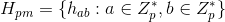
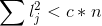
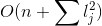

# Sem2Algorithms

Лабораторна №1: Ідеальне хешування.

Ідеальне хешування - це хешування статичних даних (тобто після ініціалізації хеш-таблиці данних до неї додати чи виделити з неї вже не можна, тільки пошук за ключем з гарантованим найгіршим часом O(1)).
Це дозволяє більш еффективно використати памьять.

В моїй реалізації використано алгоритм дворівневого хешування (тобто хеш-таблиця `PerfectHashTable` з хеш-таблиць `Bucket`) з відкритою адресацією (на другому рівні дані зберігаются у самих комірках таблиці, не в списках чи деревах). Гарно проілюстрована у Кормені : 

m - розмір таблиці, mj - розмір внутрішньої таблиці, p - просте число, що бульше за будь-який ключ
За теоремою розмір внутрішньої таблиці повинен бути квадратом кількості елементів в ній, щоб при побудові ймовірність колізії була менша 1/2 (called birthday paradox).

Хеш функція виберається з універсального класса хеш-функцій:

.gif)

Тобто достатньо вибрати довільне а та b для отримання нової хеш-функції. 

Алгоритм побудови такий:
1. Вибрати хеш-функцію випадковим чином для зовнішньої таблиці
2. Вибрати розмір для неї (повинен бути простим числом, щоб хеш функція охоплювала усі можливі комірки таблиці)
3. Для кожної внутрішньої комірки (`Bucket`) теж вибрати випадково а та b для створення нової хеш-функції. 
4. Додати усі елементи з `values`

1.5 Якщо сума внутрішніх розмірів не задовольняє нашим вимогам  (lj - кількість елементів в таблиці, c - `capacityConstant` - ми вибераємо, n - розмір `values`) то переходимо до кроку 1.
3.5 Якщо колізія на внутрішньому рівні при додаванні -> крок 3

Розмір:   => O(n) бо обмежуемо вільну частину у понкті 1.5
Час побудови: O(поліном) з великою ймовірністю. ([пояснення складне](https://youtu.be/z0lJ2k0sl1g?t=1h9m11s))

Сорока Роман К-28
