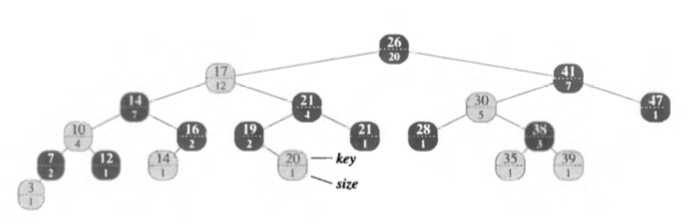

# Лабораторна №2: Дерево порядкової статистики.

Дерево порядкової статистики - основане на червоно-чорному з додатковим полем - `size` ( = кількості елементів у піддереві + 1) та функціями пошуку елемента з рангом `withRank` та визначення рангу елемента `whatRank`

Ранг - послідовний номер елемента за зростанням/спаданням (як нумерація в масиві)
Використовують структуру данних - дерево - для зменшення часу цих основних операцій з O(n) до O(log n)

`withRank` - рекурсивна функція. Ідея: ранг = кількості елементів зліва від заданого елемента + 1. 
Напр. з малюнку ранг елем. 16 == 7, елем 26 == 13.
Тому ми ідемо рекурсивно вліво чи вправо в залежності чи шуканий елемент має зліва більше елементів за ранг чи менше.

`whatRank` - спочатку біноміальний пошук елементу за його значенням O(log n) потім саме визначення рангу. Ідея: ідемо вверх до кореня і додаємо кількість елементів зліва від нашого елементу (`rank += x->parent->left->size`)

Сорока Роман К-28
